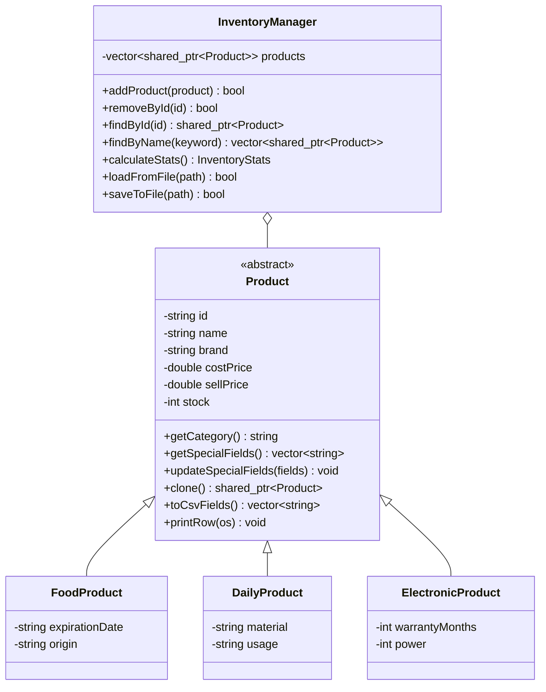
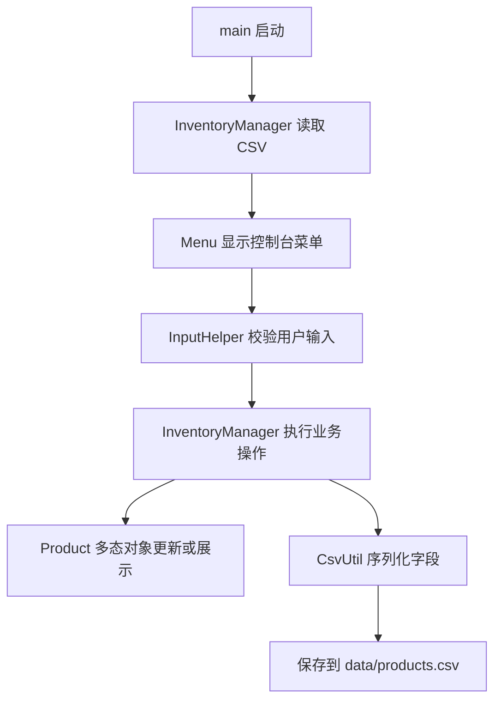

# 超市商品库存管理系统设计与测试报告

## 一、需求分析

### 1. 项目背景

本项目实现一个超市商品库存管理系统，用于对商品这类结构化数据进行添加、删除、修改、查询、统计、排序、库存预警、文件保存和文件读取。程序采用控制台美化菜单，不依赖第三方图形库，便于在课程验收环境中直接编译运行。

### 2. 用户角色

- 管理员：负责录入、维护、查询和统计商品库存数据。
- 课程验收者：检查项目是否满足面向对象设计、批量数据管理、文件持久化、异常输入处理和界面友好等要求。

### 3. 功能需求

- 添加商品：支持食品、日用品、电子产品。
- 删除商品：按商品编号删除。
- 修改商品：按商品编号修改通用字段和类别专属字段。
- 查询商品：支持按编号精确查询、按名称模糊查询、按类别筛选。
- 显示商品：以固定列宽表格显示全部商品。
- 库存统计：统计商品数量、库存总件数、库存总成本、预计销售额、预计利润和分类数量。
- 库存预警：显示库存小于等于用户输入阈值的商品。
- 排序显示：支持按售价和库存升序或降序显示。
- 文件操作：启动时读取 `data/products.csv`，保存或退出时写回该文件。
- 鲁棒输入：处理非数字菜单项、负价格、负库存、重复编号、空编号和损坏 CSV 行。

### 4. 非功能需求

- 使用 C++17 和标准库实现。
- 使用面向对象范式设计商品实体。
- 使用派生类和多态体现相似类别差异。
- 使用 STL 容器和智能指针管理批量商品。
- 文件职责清晰，业务逻辑、文件读写、输入处理和菜单界面分离。
- 程序多次运行后可以继续处理之前保存的数据。

## 二、架构设计

### 1. 文件结构

| 文件 | 职责 |
| --- | --- |
| `include/Product.h` | 定义商品基类和三个派生类接口 |
| `src/Product.cpp` | 实现商品字段、派生类、多态接口和表格显示 |
| `include/InventoryManager.h` | 定义库存管理类和统计结果结构体 |
| `src/InventoryManager.cpp` | 实现增删改查、统计、排序、预警、文件读写 |
| `include/CsvUtil.h` | 定义 CSV 工具函数 |
| `src/CsvUtil.cpp` | 实现 CSV 字段转义、拼接和解析 |
| `include/InputHelper.h` | 定义输入校验函数 |
| `src/InputHelper.cpp` | 实现整数、小数、字符串输入的鲁棒处理 |
| `include/Menu.h` | 定义菜单界面类 |
| `src/Menu.cpp` | 实现控制台菜单流程 |
| `src/main.cpp` | 程序入口，加载数据并启动菜单 |
| `tests/test_inventory.cpp` | 使用 `assert` 的核心功能测试 |
| `data/products.csv` | 商品数据文件 |
| `.vscode/tasks.json` | VS Code 中调用 MSVC 编译和测试的任务 |
| `.vscode/launch.json` | VS Code 调试配置 |

### 2. 类职责

- `Product`：抽象商品基类，保存编号、名称、品牌、进价、售价、库存等通用字段，并定义类别、多态克隆、类别字段和 CSV 字段导出接口。
- `FoodProduct`：食品类商品，增加保质期和产地。
- `DailyProduct`：日用品类商品，增加材质和用途。
- `ElectronicProduct`：电子产品类商品，增加保修月数和功率。
- `InventoryManager`：统一管理 `std::vector<std::shared_ptr<Product>>`，提供添加、删除、查询、统计、排序、预警和文件持久化。
- `CsvUtil`：只处理 CSV 文本格式，不了解商品业务。
- `InputHelper`：只处理用户输入校验，不直接操作商品集合。
- `Menu`：只负责用户交互和调用库存管理接口。

### 3. UML 类图



### 4. 数据流



## 三、关键实现说明

### 1. 多态设计

系统通过 `Product` 抽象基类统一管理商品。不同商品类别通过派生类保存专属字段，并重写 `getCategory()`、`getSpecialFields()`、`updateSpecialFields()` 和 `clone()`。库存管理类不需要知道具体商品类型，可以通过基类指针统一处理不同商品。

### 2. 文件持久化

商品数据保存为 CSV 文本，每行代表一个商品。第一列保存类别，用于读取时恢复为对应派生类对象。`CsvUtil` 支持逗号和双引号转义，避免商品名称中出现逗号时破坏字段结构。读取时会处理 UTF-8 BOM，并跳过空行和损坏行。

### 3. 鲁棒性处理

- `InputHelper` 使用整行读取和严格解析，避免 `cin` 失败状态影响后续输入。
- 商品编号不能为空，且 `InventoryManager::addProduct` 会拒绝重复编号。
- 价格和库存必须大于等于 0。
- 文件不存在时允许空库存启动。
- CSV 损坏行会被跳过，不会导致程序崩溃。
- 排序函数返回拷贝后的指针数组，不改变原始存储顺序。

## 四、测试报告

### 1. 自动化测试

测试文件：`tests/test_inventory.cpp`

MSVC 编译并运行：

```powershell
.\scripts\test_msvc.cmd
```

测试覆盖：

- CSV 转义和解析。
- 食品、日用品、电子产品的多态字段。
- 商品添加、重复编号拒绝、删除、查询。
- 库存统计、低库存预警、排序不改变原始顺序。
- CSV 文件保存、读取、UTF-8 BOM 表头处理、空行处理和损坏行跳过。

实际结果：自动化测试通过。损坏行测试会输出“提示：读取文件时跳过 1 行无效数据。”，这是预期日志。

### 2. 手动测试用例

| 编号 | 测试内容 | 输入 | 预期结果 | 当前记录 |
| --- | --- | --- | --- | --- |
| T01 | 添加食品 | `P001, Milk` | 添加成功 | 通过 |
| T02 | 添加重复编号 | 再次添加 `P001` | 提示编号重复 | 通过 |
| T03 | 添加负价格 | `-3.5` | 拒绝并要求重输 | 通过 |
| T04 | 删除存在商品 | `P001` | 删除成功 | 自动化测试通过 |
| T05 | 删除不存在商品 | `UNKNOWN` | 提示未找到 | 自动化测试通过 |
| T06 | 按名称查询 | `Milk` | 显示匹配商品 | 自动化测试通过 |
| T07 | 库存预警 | 阈值 `30` | 显示库存小于等于 30 的商品 | 通过 |
| T08 | 文件保存读取 | 保存后重启 | 数据仍存在 | 通过 |
| T09 | 损坏 CSV 行 | 缺字段行 | 跳过且程序不崩溃 | 通过 |
| T10 | 排序显示 | 按售价升序 | 商品按售价升序显示 | 通过 |

### 3. 当前验证环境说明

当前机器已安装 Visual Studio 2022 C++ 工具链，安装路径为 `D:\C++`。普通 PowerShell 中 `g++`、`clang++`、`cl.exe` 不在 PATH 内，因此不能直接输入 `g++` 或 `cl` 编译。项目已在 `.vscode/tasks.json` 中配置为先调用 `D:\C++\Common7\Tools\VsDevCmd.bat` 加载 MSVC 环境，再使用 `cl.exe` 编译。

已执行的验证：

- VS Code JSON 配置解析通过。
- 主程序通过 `scripts/build_msvc.cmd` 编译通过。
- 自动化测试 MSVC 编译并运行通过。
- 脚本化菜单验收通过：非法菜单输入、负价格、负库存、重复编号、统计、预警、排序、保存。
- 恢复策略验收通过：损坏 CSV 行会记录日志，有效商品继续显示，退出保存后损坏行被清理。

## 五、风险分析

| 风险 | 影响 | 控制方式 |
| --- | --- | --- |
| CSV 字段含逗号或引号 | 文件读取错位 | `CsvUtil` 统一转义和解析 |
| 文件不存在 | 启动失败 | `loadFromFile` 允许空库存启动 |
| UTF-8 BOM 表头 | 表头误判为损坏行 | 读取时剥离 BOM |
| 空行或 CRLF | 误判为损坏行 | 空白行跳过 |
| CSV 损坏行 | 程序崩溃 | 单行跳过并提示 |
| 非数字输入 | 菜单或数值读取失败 | `InputHelper` 循环重试 |
| 重复编号 | 数据唯一性破坏 | `addProduct` 统一检查 |
| 派生字段类型错误 | 电子产品字段异常 | 更新前严格整数解析 |
| 排序改变原数据 | 后续显示顺序混乱 | 排序返回拷贝 |

## 六、总结

本项目覆盖课程要求中的面向对象设计、派生与多态、STL 和智能指针、文件读写、批量数据管理、输入鲁棒性、菜单交互和测试文档。系统结构清晰，核心业务与界面输入分离，便于维护和扩展。
